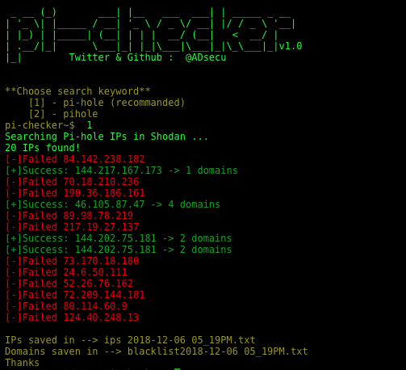
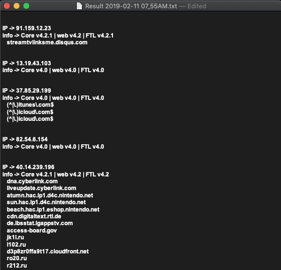

# pi-checker
set Target IP or Use shodan API to find Pi-hole IPs to steal [blacklist] & get info about Pi-hole version.such as core,web and FTL.


## Screenshot



## Requirements
**Python3.6 or higher**
- Pihole-api |  `python3 -m pip install --no-cache-dir PiHole-api`
- Shodan API | `pip3 install shodan`
- requests   | `pip3 install requests`
### Shodan API key
open **pi-checker.py** replace `Shodan API Here`(Line:10) with your key :) 

## Usage
```
python3 pi-checker.py 
```
Optional arguments (use only one arg)
```
-h , --help     show this help message and exit
-l , --limit    set Number of results from Shodan
-t , --target   set Target IP
```

#### Example 
```
python3 pi-checker.py -l 99
```
or
```
python3 pi-checker.py -t 10.0.0.1
```
## Note:
- If connection takes more than 30 seconds, press `Ctrl+c` to skip .
- You can use Target IP without Shodan API key :) .
#### Note+1:
You can find Result in txt file in same folder:
1. Result 2019-02-11 11_55PM.txt

 
 ## Who am i ?
 Ahmad A. Alsrehy
 
 Twitter : [@ADsecu](http://twitter.com/adsecu) 
