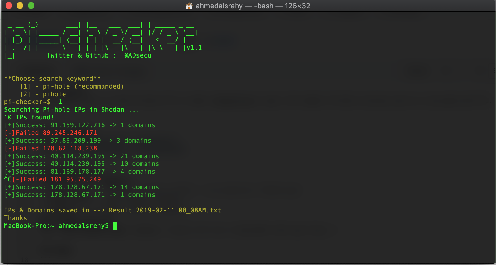

# pi-checker
Use shodan API to find Pi-hole IP and steal [blacklist]


## Screenshot


## Requirements
**Python3.6 or higher**
- Pihole-api |  `python3 -m pip install --no-cache-dir PiHole-api`
- Shodan API | `pip3 install shodan`
- requests   | `pip3 install requests`
### Shodan API key
open **pi-checker.py** replace `Shodan API Here`(Line:10) with your key :) 

## Usage
```
python3 pi-checker.py 
```
Optional arguments
```
-h , --help     show this help message and exit
-l , --limit    set Number of results
```

#### Example 
```
python3 pi-checker.py -l 99
```
## Note:
- If connection takes more than 30 seconds, press `Ctrl+c` to skip .
#### Note+1:
Automatically create two files:
1. IPs.txt --> save all IPs
2. blacklists.txt --> Domains
 
 ## Who am i ?
 Ahmad A. Alsrehy
 
 Twitter : [@ADsecu](http://twitter.com/adsecu) 
